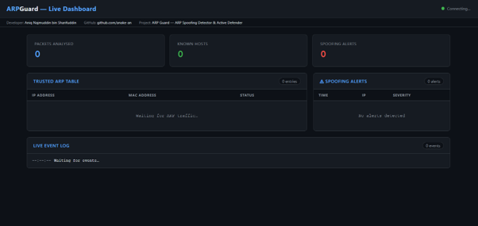
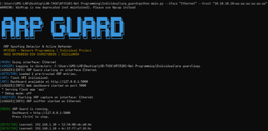

# 🛡️ ARP Guard — ARP Spoofing Detector & Active Defender
 

**ARP Guard** is a Python-based network security tool that detects and actively counters ARP spoofing attacks in real time. 

The system passively monitors ARP traffic on a chosen network interface, builds a trusted IP-to-MAC mapping table, and immediately raises an alert the moment a packet contradicts a known-good mapping. When spoofing is confirmed, it does not just log the event, it fires a corrective gratuitous ARP burst to restore the legitimate mapping across the LAN. A live web dashboard provides the operator full visibility over all detected events.

---

## 📸 Screenshots

| Live Web Dashboard | Terminal Detection & Defense |
|:---:|:---:|
|  |  |

---

## 🚀 Key Features & Network Concepts

| Concept | Where Used |
|---|---|
| **Raw Packet Capture** | `sniffer.py` — Scapy `sniff()` with BPF filter `"arp"` |
| **Client-Server Model** | `api.py` — Flask HTTP server; browser as client |
| **RESTful API** | `api.py` — 5 JSON endpoints (GET ×4, POST ×1) |
| **WebSocket Comm.** | `api.py` — Flask-SocketIO real-time push events |
| **Multi-Threading** | `main.py` — 3 concurrent threads with `threading.Lock` |
| **Active Frame Injection**| `defender.py` — Scapy `sendp()` Ethernet frame injection |

---

## 📁 Project Structure

```text
arp_guard/
├── assets/
│   └── images/          # Screenshots for documentation
├── templates/
│   └── dashboard.html   # Live browser dashboard (Socket.IO + REST polling)
├── main.py              # Entry point — wires all modules and starts threads
├── sniffer.py           # Raw ARP packet capture via Scapy (Layer 2, BPF filter)
├── detector.py          # Detection engine — trust table + MAC mismatch logic
├── defender.py          # Active defense — corrective gratuitous ARP burst
├── logger.py            # Structured logging to daily log files + memory buffer
├── api.py               # Flask REST API + Flask-SocketIO WebSocket server
├── simulate_attack.py   # Attack simulator for testing and verification
├── requirements.txt     # Python dependencies
├── LICENSE              # MIT License
└── README.md            # This file

```
---

## 🛠️ Installation

1. Clone the repository:
   ```
   git clone [https://github.com/anake-an/ARP-Guard.git](https://github.com/anake-an/ARP-Guard.git)
   cd ARP-Guard
   ```
2. Install dependecies:
   ```
   pip install -r requirements.txt
   ```
---

## ▶️ Usage

1. Start ARP Guard (Detection + Active Defense)
   ```
   # Auto-detect interface
   python main.py

   # Specify interface
   python main.py --iface "Ethernet"

   # Pre-seed a trusted gateway entry
   python main.py --iface "Ethernet" --trust "192.168.1.1=aa:bb:cc:dd:ee:ff"

   # Detection-only mode (no corrective ARP broadcast)
   python main.py --iface "Ethernet" --no-defend
   ```
2. Open the live dashboard
   ```
   http://127.0.0.1:5000
   ```
3. Run the Attack Simulator (Testing)
   ```
   python simulate_attack.py --iface "Ethernet" --target-ip 10.10.10.10 --fake-mac bb:bb:bb:bb:bb:bb
   ```
   The simulator sends forged ARP Reply packets to trigger the detection engine, allowing the full pipeline (detection → alert → defense → dashboard update) to be verified.

---

## ⚠️ Warning
This tool and its attack simulator are for educational and testing purposes only. Only run on networks you own or have explicit written permission to test.

   
   
   
   
   
